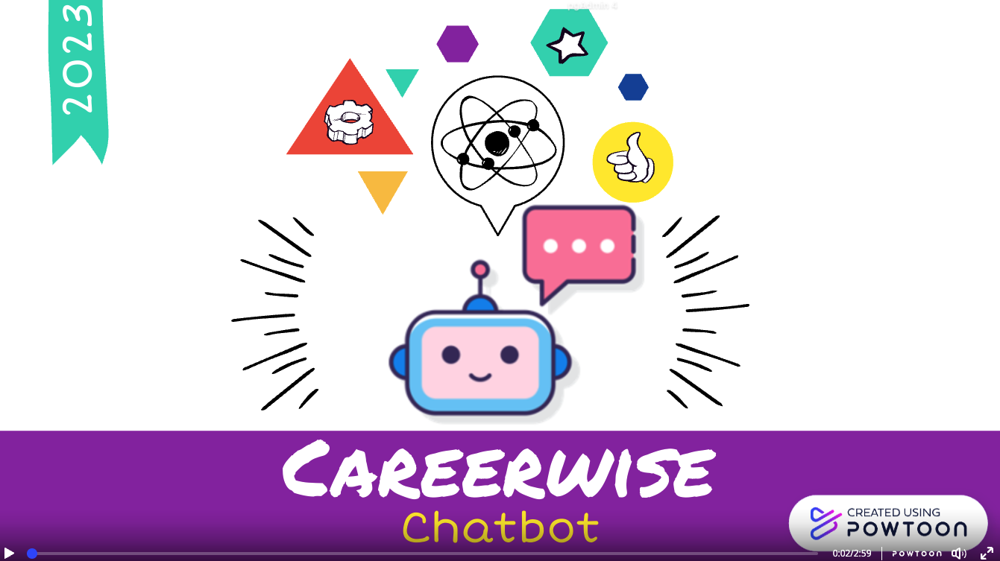

### IRS-PM-2023-01-28-GRP1-CareerWise-Chatbot

Testing main branch protection
## PROJECT TITLE
## CareerWise Chatbot - Career Path Recommendation

---

## CREDITS / PROJECT CONTRIBUTION

| Official Full Name  | Student ID (MTech Applicable)  | Work Items (Who Did What) | Email (Optional) |
| :------------ |:---------------:| :-----| :-----|
| Borromeo, Angelie Quiapo | A0270177A | Project Manager and Documentation| angelieqborromeo@gmail.com |
| Chua Jack Yune | A0269363U | Main Developer | jckynchua@yahoo.com |
| Nilothpal Bhattacharya | E1113631 | Ideation | e1113631@u.nus.edu |
| Kwatt Ivy | A0269639H | Secondary Developer| kwattivy@gmail.com|

---

## EXECUTIVE SUMMARY / PAPER ABSTRACT

Making career decision is hard, it is even harder when your career 
conflicts with your passion. For a fresh graduate, that will be 40
years for the rest of their life doing something without much joy
and passion. CareerWise Chatbot can help them decide a career choice
that matters. 

To help individual with this dilemma, we design a chatbot that can
deliver a tailored career path recommendations based on user input
on either their interests or domain of expertise. CareerWise Chatbots
can also provide additional information about education programs, 
such as course descriptions, and university options and potential
compensation trend. 

The benefits of using CareerWise Chatbots for career path selection
include convenience, accessibility, and personalised recommendations. 
CareerWise Chatbots can be potentially accessed through a variety of 
platforms, including social media, messaging apps, and websites 
(but for this project implementation the team have created a python 
flask base application which is intended to be hosted in a Public 
Cloud Platform). This makes it easier for individuals to receive 
initial career path recommendations on the go, without the need 
for lengthy research or face to face consultations.

We hope to provide a convenient and personalised way to receive
career recommendations, making the career path selection process
more accessible and efficient. As technology continues to evolve,
it is likely that chatbots will become an increasingly important 
part of education and career path selection.

---
## SECTION 1 : BUSINESS PROBLEM AND PROBLEM BACKGROUND
`Refer to project report at Github Folder: ProjectReport`

---

## SECTION 2 : PROJECT OBJECTIVE
`Refer to project report at Github Folder: ProjectReport`

---

## SECTION 3 : SYSTEM'S FEATURE
`Refer to project report at Github Folder: ProjectReport`

---

## SECTION 4 : KNOWLEDGE MODELLING
`Refer to project report at Github Folder: ProjectReport`

---

## SECTION 5 : SOLUTION AND SYSTEM ARCHITECTURE  (VIDEO OF SYSTEM & USE CASE DEMO)
`Refer to project report at Github Folder: ProjectReport`

[CareerWise_Chatbot_System_Design](https://drive.google.com/file/d/1kiO1Pe0fBjxBLA0Jzimh2iA2OzNbUkAj/view?usp=share_link)
[CareerWise_Chatbot_Marketing_Video](https://youtu.be/Btl_fdIJPC8)
---

## SECTION 6 : OVERALL SYSTEM ARCHITECTURE
`Refer to project report at Github Folder: ProjectReport`

---
## SECTION 7 : LIMITATIONS
`Refer to project report at Github Folder: ProjectReport`

---
## SECTION 8 : CONCLUSION
`Refer to project report at Github Folder: ProjectReport`

---
## SECTION 9 : IMPROVEMENTS
`Refer to project report at Github Folder: ProjectReport`

---
## SECTION 10 : BIBLIOGRAPHY
`Refer to project report at Github Folder: ProjectReport`

---
## SECTION 11 : APPENDIX
`Refer to project report at Github Folder: ProjectReport`

## SECTION 6 : PROJECT REPORT / PAPER
`Refer to project report at Github Folder: ProjectReport`

- Appendix A1: Interview with Subject Matter Expert
- Appendix A2: Survey Results (Refer to Github Folder: Miscellaneous/CareerJouney_Survey_Result_21052023.xlsx)
- Appendix B: Map of the System Functionalities against Modules
- Appendix C: Sample Test Scripts use to answer CareerWise Chatbot
- Appendix D: Individual Project Report
- Appendix E: User Guide

---
## USER GUIDE

`Refer to UserGuide.pdf in project report at Github Folder: ProjectReport`

This video intends to guide the user in installing and configuring CareerWise Chabot in local machine.
[Intallation and User Guide](https://drive.google.com/file/d/13NQYipt-6jEE9UmYIh8rRoNrPyelWmnB/view?usp=share_link)

### [ 1 ] To run the system in other/local machine:
### Install additional necessary libraries. This application works in python 3.10 only.
### Postgres Database needs to be installed in your workstation 

> Download Postgres Database and install [PostgreSQL_Download](https://www.postgresql.org/download/)

> Clone the Github repository of CareerWise Chatbot.  $ git clone https://github.com/aqborromeo/IRS-PM-2023-01-28-GRP1-CareerWise-Chatbot.git

> Configuring the backend. $ cd IRS-PM/IRS-PM-2023-01-28-GRP1-CareerWise-Chatbot/SystemCode/src/backend

> $ cp .env.careerwise .env

> $ source .env

> open and virtual env that has python 3.10 (refer to the System Setup Video for Reference).

> $ pip install poetry

> $ poetry install

> $ pip install dotenv load_dotenv flask_restful flask_cors Levenshtein jwt flask_pydantic pandas sentence_transformers flask_seeder psycopg2 PyJWT

> $ alembic upgrade head

> $ flask seed run

> $ flask run

> **Go to URL using web browser to access the frontend and register an account**  http://localhost:8080/ 

---

### <<<<<<<<<<<<<<<<<<<< End of Template >>>>>>>>>>>>>>>>>>>>

---

**This [Machine Reasoning (MR)](https://www.iss.nus.edu.sg/executive-education/course/detail/machine-reasoning "Machine Reasoning") course is part of the Analytics and Intelligent Systems and Graduate Certificate in [Intelligent Reasoning Systems (IRS)](https://www.iss.nus.edu.sg/stackable-certificate-programmes/intelligent-systems "Intelligent Reasoning Systems") series offered by [NUS-ISS](https://www.iss.nus.edu.sg "Institute of Systems Science, National University of Singapore").**

**Lecturer: [GU Zhan (Sam)](https://www.iss.nus.edu.sg/about-us/staff/detail/201/GU%20Zhan "GU Zhan (Sam)")**

**zhan.gu@nus.edu.sg**
